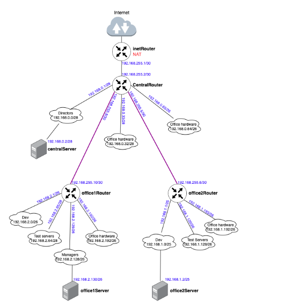

Планируемая архитектура

построить следующую архитектуру

Сеть office1
* 192.168.2.0/26 - dev
* 192.168.2.64/26 - test servers
* 192.168.2.128/26 - managers
* 192.168.2.192/26 - office hardware
<br>

Сеть office2
* 192.168.1.0/25 - dev
* 192.168.1.128/26 - test servers
* 192.168.1.192/26 - office hardware
<br>

Сеть central
* 192.168.0.0/28 - directors
* 192.168.0.32/28 - office hardware
* 192.168.0.64/26 - wifi

Итого должны получится следующие сервера

* inetRouter
* centralRouter
* office1Router
* office2Router
* centralServer
* office1Server
* office2Server

#### Теоретическая часть

Найти свободные подсети
Посчитать сколько узлов в каждой подсети, включая свободные
Указать broadcast адрес для каждой подсети
проверить нет ли ошибок при разбиении

#### Практическая часть

Соединить офисы в сеть согласно схеме и настроить роутинг
Все сервера и роутеры должны ходить в инет черз inetRouter
Все сервера должны видеть друг друга
у всех новых серверов отключить дефолт на нат (eth0), который вагрант поднимает для связи
при нехватке сетевых интервейсов добавить по несколько адресов на интерфейс




### Решение 

#### Теоритическая часть 

##### Немного теории

Расчеты можно выполнить вручную, или воспользоваться калькулятором сетей. Для примера, посчитаем одну подсеть вручную:

У нас есть сеть directors 192.168.0.0/28
192.168.0.0 — это сама сеть, 28 — это маска. Маска показывает нам, границы сети 192.168.0.0. Маска может быть записана в 2-х видах: 
1) /28
2) 255.255.255.240


Пример перевода маски /28 в формат 255.255.255.240:

Маска Ipv4-адреса — это 4 октета, т.е. 4 блока по 8 цифр (1 или 0). 
/28 — это 28 единиц с начала маски: 11111111.11111111.11111111.11110000  
Всегда при разбиении сетей, после знака / указывается количество единиц с начала маски.

11111111.11111111.11111111.11110000 — это двоичный код маски, если мы переведем данное значение в десятичную систему счисления, то получим 255.255.255.240

Далее посчитаем количество устройств в сети: 
Количество устройств в сети рассчитывается по формуле = 232−маска−2
Таким образом, количество устройств для подсети /28 будет = 232−28−2=16−2=14

Цифра 2 вычитается, так как:
Первый адрес (192.168.0.0) — это наименование подсети, его нельзя задать устройству
Последний адрес (192.168.0.15) — это всегда broadcast-адрес. Broadcast-адрес нужен для рассылки всем устройствам сети. 

Таким образом мы можем сформировать таблицу топологии нашей сети

##### Расчет 
После расчета всех сетей, мы должны получить следующую таблицу топологии

<br>

--------------------------------------------------
|Name|Network|Netmask|N|Hostmin|Hostmax|Broadcast|
|:----:|-------|:-------:|-|-------|-------|---------| 
|||               **Central Network**               |
|Directors | 192.168.0.0/28| 255.255.255.240 | 14 |192.168.0.1| 192.168.0.14| 192.168.0.15|
| Office hardware |192.168.0.32/28 |255.255.255.240| 14 |192.168.0.33| 192.168.0.46| 192.168.0.47|
|Wifi(mgt network)| 192.168.0.64/26 |255.255.255.192|62 |192.168.0.65 | 192.168.0.126|192.168.0.127|
|||**Office 1 network** |
| Dev | 192.168.2.0/26| 255.255.255.192| 62| 192.168.2.1|192.168.2.62| 192.168.2.63|
|Test| 192.168.2.64/26| 255.255.255.192| 62| 192.168.2.65|192.168.2.126| 192.168.2.127|
|Managers| 192.168.2.128/26| 255.255.255.192| 62 | 192.168.2.129 | 192.168.2.190| 192.168.2.191|
|Office hardware| 192.168.2.192/26| 255.255.255.192| 62| 192.168.2.193 | 192.168.2.254| 192.168.2.255|
|||**Office 2 network**|
|Dev | 192.168.1.0/25| 255.255.255.128 | 126 | 192.168.1.1| 192.168.1.126| 192.168.1.127|
|Test |192.168.1.128/26 |255.255.255.192 | 62| 192.168.1.129 | 192.168.1.190| 192.168.1.191|
|Office| 192.168.1.192/26 | 255.255.255.192 | 62 | 192.168.1.193 | 192.168.1.254| 192.168.1.255 |
|||InetRouter — CentralRouter network| 
| Inet — central|  192.168.255.0/30 | 255.255.255.252 | 2 | 192.168.255.1| 192.168.255.2|192.168.255.3|
-----------------------------------------------------------------------------------------------------------

<br>
После создания таблицы топологии, мы видим, что ошибок в задании нет, также мы сразу видим следующие свободные сети: 

* 192.168.0.16/28 
* 192.168.0.48/28
* 192.168.0.128/25
* 192.168.255.64/26
* 192.168.255.32/27
* 192.168.255.16/28
* 192.168.255.8/29  
* 192.168.255.4/30 


#### Практическая часть 

1) Скачаем Git репозиторий -
```bash 
 git clone https://github.com/jecka2/network.git
 ```

2) Не забываем в случае с virtual box  произвести настройку для того, что бы мы могли в качестве hosted network могли использовать сети ниже чем 192.168.56.0/24 согласно https://www.virtualbox.org/manual/ch06.html#network_hostonly

```bash
sudo nano /etc/vbox/networks.conf
* 192.168.0.0/24
* Ваша сеть/маска_сети
```

3) Запустим Vagrant для создания виртуальных машин ( inetRouter,centralRouter,office1Router,office2Router,centralServer,office1Server,office2Server )

 ```bash 
vagrant up
```


Пытаемся с центрального роутера "дойти"  до 8.8.8.8 

```bash
jecka   ~/Documents/git/network  ssh vagrant@192.168.50.11 -i .vagrant/machines/centralRouter/virtualbox/private_key
Last login: Sun Sep 21 13:56:54 2025 from 192.168.50.1
vagrant@centralRouter:~$ traceroute 8.8.8.8
traceroute to 8.8.8.8 (8.8.8.8), 30 hops max, 60 byte packets
 1  192.168.255.1 (192.168.255.1)  0.455 ms  0.507 ms  0.492 ms
 2  10.0.2.2 (10.0.2.2)  1.429 ms  1.405 ms  1.341 ms
 3  10.78.16.1 (10.78.16.1)  2.883 ms  2.831 ms  2.813 ms
 4  не палимся).pool.sknt.ru (и тут тоже)  2.759 ms  2.983 ms  3.365 ms
 5  Router.sknt.ru (93.100.0.132)  2.545 ms  2.482 ms  2.461 ms
 6  SEL-CORE (185.37.128.106)  2.353 ms  4.696 ms  4.570 ms
 7  * * *
 8  * * *
 9  72.14.216.110 (72.14.216.110)  2.571 ms  2.368 ms  2.132 ms
10  dns.google (8.8.8.8)  5.813 ms  5.588 ms  5.204 ms
```

